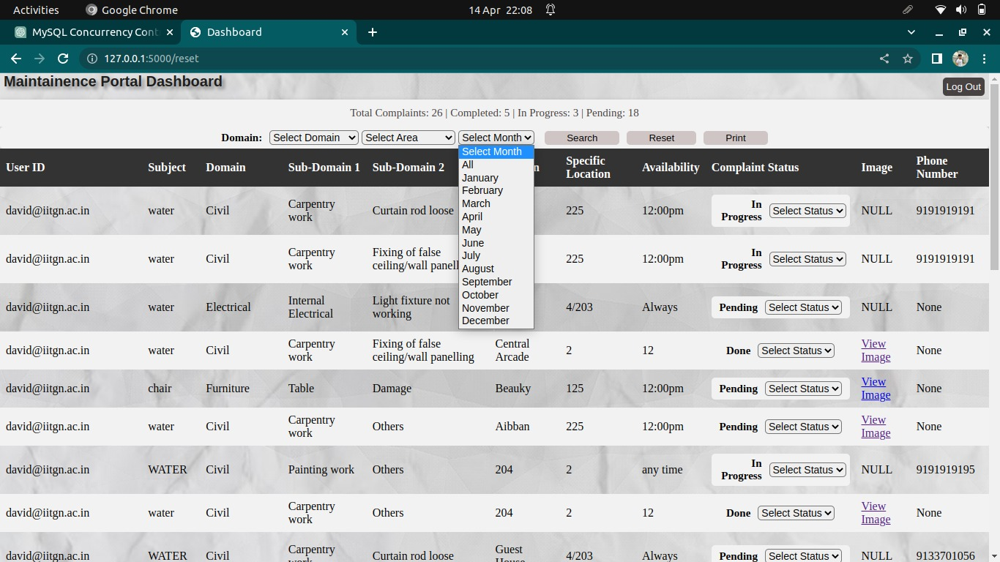

# Assignment-4

Table of contents- [Assignment-4](#assignment-4)
- [Assignment-4](#assignment-4)
- [Responsibility of G1](#responsibility-of-g1)
  - [Question 1](#question-1)
  - [Before Feedback 1](#before-feedback-1)
  - [After Feedback-1](#after-feedback-1)
  - [Second Feedback](#second-feedback)
  - [Question 2](#question-2)
    - [Admin's Privilages:](#admins-privilages)
    - [User's Privilages:](#users-privilages)
  - [Responsibility of G2](#responsibility-of-g2)
    - [Question-1](#question-1-1)
    - [Question-2](#question-2-1)
  - [Responsibility for both G1 and G2](#responsibility-for-both-g1-and-g2)
  - [Question-1](#question-1-2)
    - [Back-end attack](#back-end-attack)
- [One extra backend attack for bonus](#one-extra-backend-attack-for-bonus)
    - [Ways to IDOR is shown below in screenshots:](#ways-to-idor-is-shown-below-in-screenshots)
    - [front-end attack](#front-end-attack)
  - [One Extra Front-End attack for bonus](#one-extra-front-end-attack-for-bonus)
  - [Question-2](#question-2-2)
- [Contributions](#contributions)


# Responsibility of G1
## Question 1

## Before Feedback 1
1. There was no "other" option in subdomain 1
   
   

   
2. No "Bed-chair-table damage” complaint option.
   
   

3. There was no area-wise filter for Housing, Academic, research park, sports complex, and central arcade for the admin's suitability. So that the admin can see all the complaints for any particular area.
4. There was no  month-wise filter for complaints for viewing all the complaints registered in that particular month.
5. no column of “Mobile Number,” Show the complainant’s mobile number to the admin.6.
6. no the "Print" option for the complaints. So that the admin can print the list of all the complaints registered within any period.


## After Feedback-1

1. Add an "Other" option in sub-domain 
   

2. Add “Bed-chair-table damage” complaint option.
   
3. Add area-wise filter for Housing, Academic, and central arcade for the admin's suitability. So that the admin can see all the complaints for any particular area.
   
   

4. Add a month-wise filter for complaints for viewing all the complaints registered in that particular month.
5. Add a column of “Mobile Number,” Show the complainant’s mobile number to the admin.
6. Add the "Print" option for the complaints. So that the admin can print the list of all the complaints registered within any period.



## Second Feedback

1. Add a Remark Column on the Admin Dashboard page. So that the admin can add the remark regarding any complaint. 
   
   

2. Add a Date filter to select queries within a specified range of dates.


3. Add the "Unable to Process" option for the complainant’s status.
   
   

## Question 2

The best views that can describe our database is Complaint table.This table or data is shown different to different users.

The privelages for different users are different.

We have two kind of users namely,
a. Admin
b. Regular User

The view for the admin is as follows:


### Admin's Privilages: 
```
Admin can change the status of the complaints.
Admin can write remarks to a complaint.
Admin has access to images posted by users (complaint images)
Admin also has filter option to filter the complaints.
``` 

The view of user is as follows:


### User's Privilages:
```
A user can just read the complaints that he raised and he cannot overwrite or write anything to the table.
```
## Responsibility of G2

### Question-1


*  We have experimented with the concurrent updates in the same table i.e. complaint table using threading in Python. Here, each thread is a user so,it is analogous to multiple users updating a single table. 
*  We noticed that the updates are consistent and isolated because connection.commit() which is already a feature of mysql.connector, handles all the locks and transactions. 
*  Here's what we got to know from chat-gpt:``` connection.commit() helpps concurrency preserve and data consistency in flask app using a database but you should use it judiciously and kee your transactions short to avoid performance issues```. 
   
* All of our transactions are short and also have connection.commit() in final which will take care of all the locks and transaction updates.
   
### Question-2
<b> Changes that we made in the database after feedback1:</b>
  
  we added three columns Area, Number, Date, respectively.

  * We added Area column to filter the database based on the areawise like hostel.
 * We added Number column to depict the phone contact of the complainant.
 * We added Date column to filter the database month wise.

  

  
 <b> Changes that we made in the database after feedback2:</b>

  we added a single column Time:

  * we added Time column, for selecting queries within a secified range of dates and print all the complaints within that range.

  <b>here is the attached link for the updates:</b>

  [link of complete database](maintenance_portal.sql)
  
  [link of sql file for added columns after feedback ](After_feedback.sql)
  


## Responsibility for both G1 and G2
 ## Question-1
  ### Back-end attack
   <font color="gren" > <b> Bruteforce: </b> </font>
      
      A brute force attack is a hacking method that uses trial and error to crack passwords and login credentials. This is typically through standard password combinations or personal identification number (PIN) codes.
      For sake of simplicity, we changed the password of admin and allowed combinations of four small alphabets. As, to performing brute force for our application, though in general it can be as large as all combinations.

  <b> PREVENTIONS:</b>
```
   How to Prevent Brute Force Attacks:

    *  download flask_limiter (to download use: "pip install flask-limiter")
    * Flask-limiter library does not allow multiple requests in a minute. Brute force sends large number of requests to crack passwords by trying different combinations. So, limiting the number of trials per user allows us to block that request from reaching our servers and thus saves our website from this attack.
```  

<b> Brute force attack successfull </b>
  
<b> Brute force attack failure (after prevention)</b>
  
<b> Web app rejecting the requests by sending 429 error</b>
  

<b>TO SEE THE BEFORE AND AFTER CHANGES CLEARLY VISIT THE BELOW LINK (VIDEO)</b>

  [Bruteforce attack video link](https://github.com/DBMS-ES-432/DBMS-Assignment-3/blob/main/videos/BruteForceAttack.webm)

  <font color="gren" ><b> SQL injection:</b></font>

     We tried to breach the login page, with a user id: 'OR'a'='a',=
     and any random password and we are able to login.
   
   The page after our login with SQL-Injection is as follows:
    
    


  <b> SQL prevention:</b>

    * update: 
   We Prevented SQLI using parametric version of mysql syntax, which takes parameters as values rather than strings directly. The update is as follows:
  ~~~~sql
      cursor.execute('SELECT * FROM User WHERE email_id = '%s' AND password = '%s', (username, password="$PASSWORD'))  
  ~~~~
      
  * WE are not able to login now, the screenshots are as follows:

     

     

     
      
<b>>TO SEE THE BEFORE AND AFTER CHANGES CLEARLY VISIT THE BELOW LINK (VIDEO)</b>
      
[SQL injection attack video link](https://github.com/DBMS-ES-432/DBMS-Assignment-3/blob/main/videos/SQLI.webm)
       
   # One extra backend attack for bonus

  <font color="gren" ><b>Insecure direct Object references (IDOR)</b></font>

    

     * The user logs into the application using their credentials, such as a username and password.
     * After logging in, the user is redirected to a page that displays their account information or a dashboard of some sort.
     * The admin page, which is intended to be accessible only to privileged users, is located at a URL like "http://127.0.0.1:5000/admin", and is not displayed in the navigation menu or any other links visible to regular users.
     * The user inspects the HTML source code of the page they are currently on, and finds a link or reference to the admin page URL.
     * The user manually edits the URL in the browser's address bar to replace the current page's URL with the admin page URL, and hits enter.
     * The server responds with the admin page, which is displayed to the user even though they are not authorized to access it.
      
### Ways to IDOR is shown below in screenshots:
step1:


step2:

   
step3:

   
<b>INVALID ACCESS USER NOT SHOULD GO TO ADMIN PAGE</b>


   
<b>AFTER PREVENTION</b>

   

  
 <b>How to Prevent Insecure direct Object references</b>

```
 we added @admin_required  after @login_required, these are two wrappers which check whether a user is logged in or not. If yes then @admin_required checks whether the user that is logged in is admin or not, if yes then only admin_page is accessed.
 ```
Here's the decorator used:


Here's how a function is wrapped using decorator:


<b>>TO SEE THE BEFORE AND AFTER CHANGES CLEARLY VISIT THE BELOW LINK (VIDEO)</b>

[insecure direct Object references (IDOR) attack video link](https://github.com/DBMS-ES-432/DBMS-Assignment-3/blob/main/videos/adminprev.webm)
      
     </font>
  ### front-end attack
  <font color="gren"> 
      <b> clickjacking: </b></font>

      Clickjacking is an attack that fools users into thinking they are clicking on one thing when they are actually clicking on another. Typically, clickjacking is performed by displaying an invisible page or HTML element, inside an iframe, on top of the page the user sees. The user believes they are clicking the visible page but in fact, they are clicking an invisible element in the additional page transposed on top of it.
      he invisible page could be a malicious page or a legitimate page the user did not intend to visit – for example, a page on the user’s banking site that authorizes the transfer of money.

    Step: we used some other framework, then we try to embed our website to this framework. So, this should not happen.

  <b>How to Prevent Clickjacking:</b>

        we are using flask talisman to prevent clickjacking.
      
  The site vulnerable to clickjacking, which means our site can be used as frame in any other web page
  

  

Changes that we did to the code (included flask-talisman library, it provides security to flask apps)
  

  
<b>After Prevention</b>
  

  

<b>>TO SEE THE BEFORE AND AFTER CHANGES CLEARLY VISIT THE BELOW LINK (VIDEO)</b>

  [clickjacking video link](https://github.com/DBMS-ES-432/DBMS-Assignment-3/blob/main/videos/clickjacking.webm)

  <font color='gren'><b>Denial-of-service attack:</b></font>
      
       A denial-of-service (DoS) attack is a tactic for overloading a machine or network to make it unavailable. Attackers achieve this by sending more traffic than the target can handle, causing it to fail—making it unable to provide service to its normal users.

       steps: we created a for loop for 1000 iterations and continuously sent the packets from a single IP address, and we observed there is a lag on the website, which is observed in the video.

  <b>How to prevent DOS attack:</b>

  * download flask_limiter
  
                        pip install flask_limiter
  * the number of attempts to access the server is limited per IP ADDRESS.

      
      [Denial-of-service attack video link](https://github.com/DBMS-ES-432/DBMS-Assignment-3/blob/main/videos/DOS.webm)

      [Denial-of-service attack solution video link](https://github.com/DBMS-ES-432/DBMS-Assignment-3/blob/main/videos/No_DOS.webm)
 ## One Extra Front-End attack for bonus
    
  <font color='gren'><b>Cross-Site Request Forgery (CSRF) attack:</b></font>

    The server generates a unique token for each user session, which is usually a long and randomly generated string.

    The token is stored on the server side and associated with the user session.

    When the user requests a form or link that sends a request to the server, the token is included in the form or link as a hidden input field or URL parameter.

    When the server receives the request, it verifies that the token included in the request matches the expected value for the user session.

    If the token is valid, the server processes the request. If the token is invalid or missing, the server rejects the request and takes appropriate action, such as redirecting the user to an error page or logging the incident.
<b>Before Prevention</b>
  

  

  
<b>Code changes</b>
  

  

  
<b>After Change or prevention</b>
  

  ## Question-2

  We added four new columns in our database complaint table. There is no change in the E-R diagram . only the extra columns has been added. so  all the relations and their constraints are same as before the second feedback. As we know adding attributes does not change any ER diagram, because they have no relation with any other tables (relation).


      


    
# Contributions
* Group G1 :-
    * Ritesh Patidar - took both feedback from stakeholder, also created views for different users 
    * Sujeet Kumar Yadav - took first feedback from stakeholder
    * Harshit Chauhan - took both feedback from stakeholder
    * Sai Krishna Avula - created views for different users, took second feedback from stakeholder
* Group G2 :-
  * Sujeet Kumar Yadav and Madhuri Awachar - Took care of multiple user concurrency, tried threading to demonstarte multu user and figured out connection.commit() itself is taking care of concurrency.
  * Sai krishna Avula and Ritesh Patidar: Implmented all the backend and front end changes.
* Group G1 and G2 :-
  * All Front end attacks and preventions are coordinated and done by following members:
      * Prajwal Jivtode 
      * Rishi Katkar
      * Onkar Mishra
      * Priyanshu Mishra
      * Madhuri Awachar
      * Pooja Goel
      * Pinki Kumari
      * Harshit Chauhan
  * All backend attacks and preventions are done by following members:
    * Sai Krishna Avula
    * Sujeet Kumar Yadav
    * Ritesh Patidar
  * Documentation: 
    * Pooja Goel
    * Pinki Kumari
    * Ritesh Patidar
    * Sai Krishna Avula

      


  
